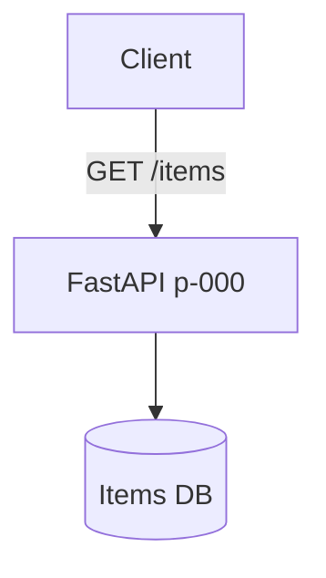
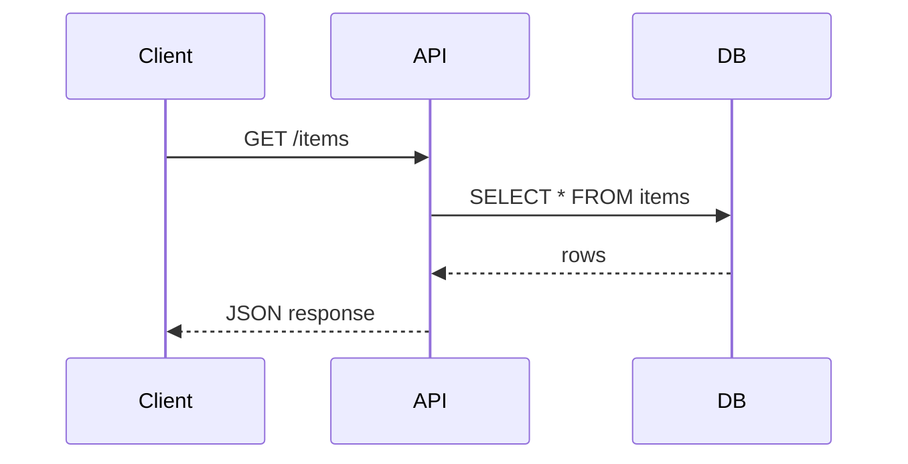

# p-000 — Items API

API REST para gestión de ítems.

## Arquitectura

## Flujo de request

## Endpoints

| Método | Path | Descripción |
|--------|------|-------------|
| GET | `/` | Health check |
| GET | `/items` | Lista todos los ítems |
| GET | `/items/{id}` | Obtiene un ítem por ID |
